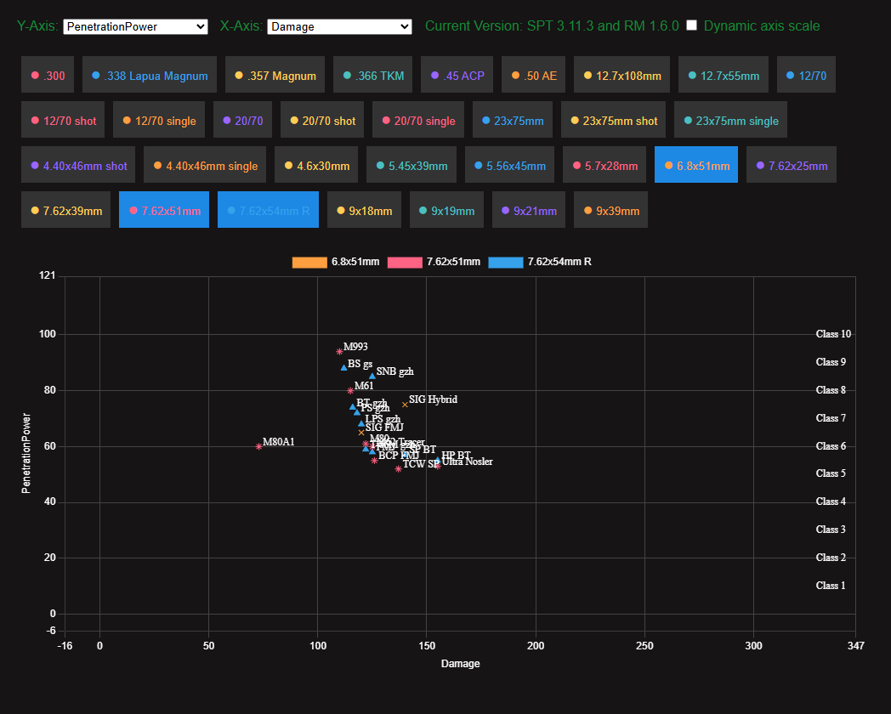
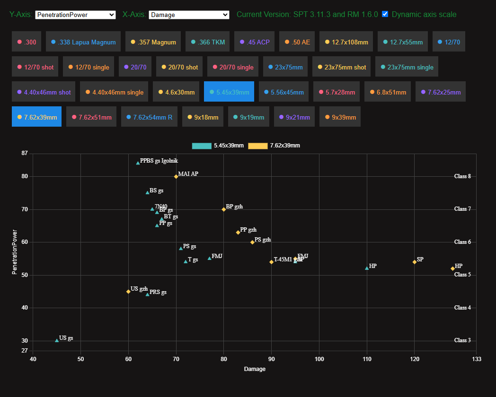

# SPT Realism Ammo Graph

This web application visualizes ammunition data for the SPT Realism Mod, displaying damage and penetration values for various calibers in a scatter plot. Users can select different calibers to compare their performance. The chart dynamically adjusts its axes and includes class labels for penetration levels.

## Usage

Visit [https://acksberg.github.io/SPTRealismAmmoGraph/](https://acksberg.github.io/SPTRealismAmmoGraph/) or download the `index.html`, `script.js`, and `data/data.js` files.

After downloading, simply open `index.html` in your browser.

The other files are examples or are used to generate `data.js`.

To update the data for your local version:

1. Place `getData.py` into the root folder of your SPT installation.
2. Run the script. It will generate a `data.js` file in the same directory.
3. Move the generated `data.js` file into the `data/` subfolder located in the same directory as your `index.html` and `script.js`. This should work with any SPT version that includes the Realism Mod.

## Files

- **getData.py**: Script to generate `data.js`.
- **index.html**: The main HTML file that structures the web page, including the canvas for the chart and buttons for selecting calibers.
- **script.js**: JavaScript file that handles data processing, chart rendering, and user interactions.
- **data.js**: Contains the ammunition data used by the web application (currently based on SPT 3.11.3 and RM 1.6.0).

## License

This project is licensed under the MIT License. See the LICENSE file for details.
